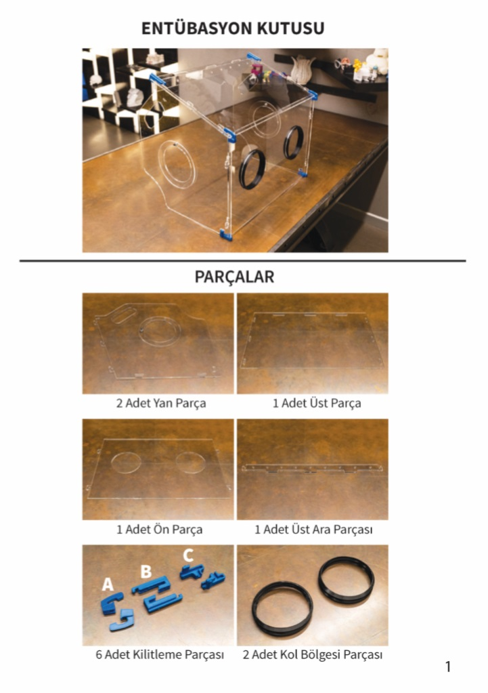
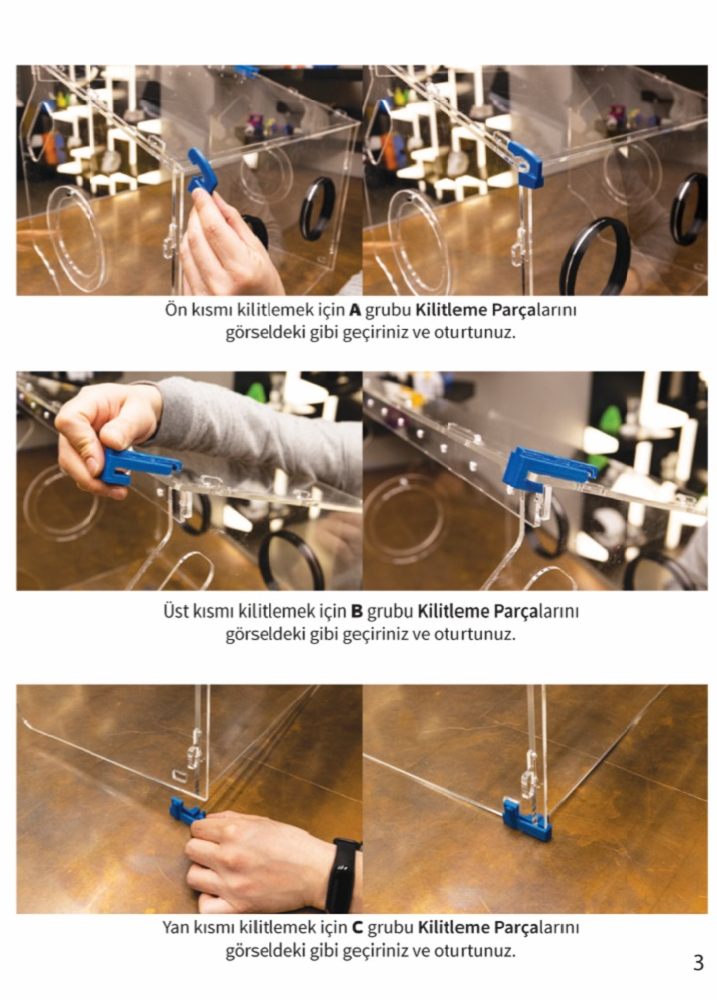

# EntubasyonKutusu
Entübasyon kutusu yapmak için gerekli olan lazer kesim ve 3D baskı dosyalarını içerir.

[Buradan](https://www.youtube.com/watch?v=W8xZaDajy4w) ulaşabileceğiniz video ile adım adım entübasyon kutusunu birleştirebilirsiniz.

## Malzemeler

* 5 mm Pleksiglas
* ABS Flament (Basılacak parçaların biraz esnek olması gerekmekte ve PLA bu esnekliği sağlayamamaktadır.)
* TPU Flament (Kol girecek kısımlar için basılacak parçaların esnek olması gerektiği için.)

## Baskı Parametreleri
* 1.2 mm Duvar Kalınlığı
* %20 İç Doluluk
* 0.2 mm Katman Kalınlığı

## Birleştirme Adımları

